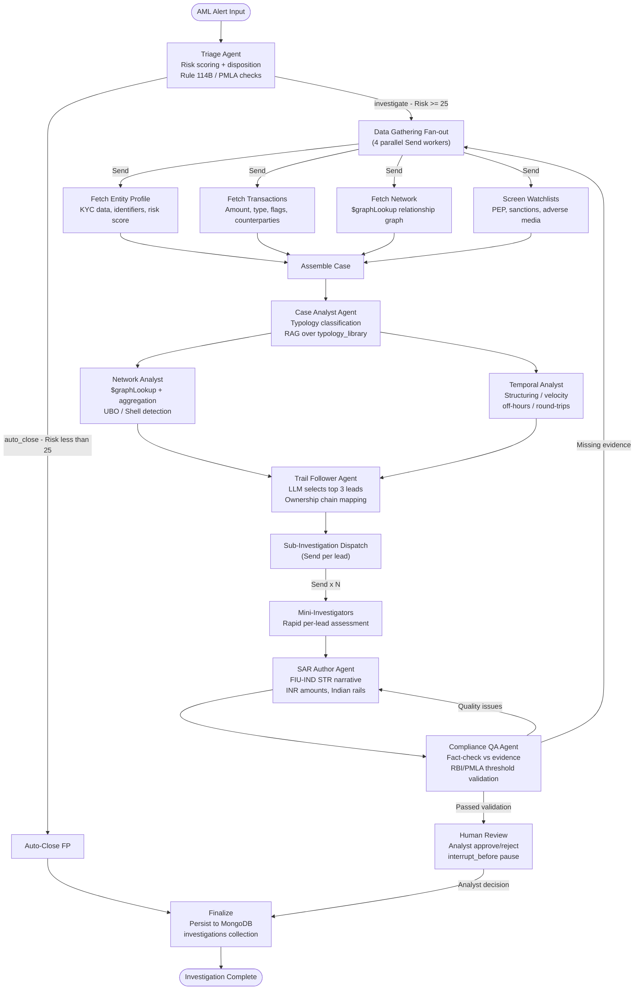
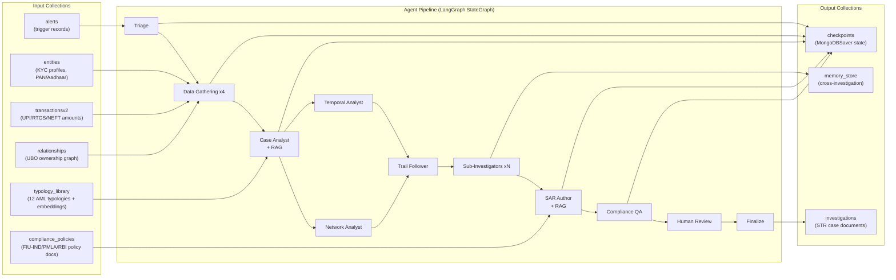

# RBI Rules, Policies & the Agentic Architecture in SentinelAI

> A deep-dive into how Indian regulatory frameworks (RBI, PMLA, FIU-IND, I4C) are woven into the SentinelAI multi-agent investigation pipeline — and exactly how each AI agent reads, transforms, and writes data.

---

## Table of Contents

1. [System Overview](#1-system-overview)
2. [Indian Regulatory Framework Embedded in the System](#2-indian-regulatory-framework-embedded-in-the-system)
   - 2.1 [Rule 114B — PAN Structuring](#21-rule-114b--pan-structuring-income-tax-rules)
   - 2.2 [PMLA Section 12 — CTR](#22-pmla-section-12--cash-transaction-report-ctr)
   - 2.3 [RBI 10% UBO Rule](#23-rbi-10-ubo-ultimate-beneficial-ownership-rule)
   - 2.4 [I4C / UPI Mule Ring Fan-out](#24-i4c--upi-mule-ring-fan-out)
   - 2.5 [IT Act Section 66D — Digital Arrest Scam](#25-it-act-section-66d--digital-arrest-cyber-scam)
   - 2.6 [Shell Entity Hawala Layering](#26-shell-entity-hawala-layering)
   - 2.7 [Future Rules (LRS, Dormant Accounts, FCRA, TBML)](#27-future-rules-planned)
3. [Agentic Architecture — Full Pipeline](#3-agentic-architecture--full-pipeline)
4. [How Each Agent Uses Data](#4-how-each-agent-uses-data)
   - 4.1 [Triage Agent](#41-triage-agent)
   - 4.2 [Data Gathering Fan-out](#42-data-gathering-fan-out-parallel-agents)
   - 4.3 [Case Analyst Agent](#43-case-analyst-agent)
   - 4.4 [Network Analyst Agent](#44-network-analyst-agent)
   - 4.5 [Temporal Analyst Agent](#45-temporal-analyst-agent)
   - 4.6 [Trail Follower Agent](#46-trail-follower-agent)
   - 4.7 [Sub-Investigator Agents](#47-sub-investigator-mini-agents)
   - 4.8 [SAR Author Agent](#48-sar-author-agent)
   - 4.9 [Compliance QA Agent](#49-compliance-qa-agent)
   - 4.10 [Human Review (HITL)](#410-human-review-human-in-the-loop)
   - 4.11 [Finalize Agent](#411-finalize-agent)
5. [Data Flow Across Collections](#5-data-flow-across-mongodb-collections)
6. [RBI Rules — Agent Enforcement Mapping](#6-rbi-rules--agent-enforcement-mapping)
7. [End-to-End Data Journey — Example](#7-end-to-end-data-journey--example)

---

## 1. System Overview

**SentinelAI** is a dual-backend financial crime detection platform built for Indian financial institutions. It operates under the regulatory jurisdiction of:

| Regulator | Jurisdiction |
|-----------|-------------|
| **RBI** (Reserve Bank of India) | KYC, UBO identification, LRS limits, dormant accounts |
| **FIU-IND** (Financial Intelligence Unit - India) | STR / CTR filing, PMLA compliance |
| **I4C** (Indian Cybercrime Coordination Centre) | UPI mule networks, cyber fraud patterns |
| **Income Tax Department** | PAN-linked transaction reporting (Rule 114B) |
| **Enforcement Directorate (ED)** | PMLA enforcement, Hawala/Layering detection |

The system uses a **LangGraph-orchestrated 6-agent pipeline** (+ sub-agents) to autonomously investigate AML alerts and generate **FIU-IND-compliant STR (Suspicious Transaction Reports)** narratives, all powered by **Claude Haiku 4.5 via AWS Bedrock** and backed by **MongoDB Atlas**.

---

## 2. Indian Regulatory Framework Embedded in the System

### 2.1 Rule 114B — PAN Structuring (Income Tax Rules)

#### What the Rule Says
Any cash deposit or transaction **exceeding Rs.50,000** requires the customer to provide their **Permanent Account Number (PAN)**. This is mandated under Rule 114B of the Indian Income Tax Rules.

#### How SentinelAI Implements It

**Data Generation Phase:**
- The synthetic data script (`generate_indian_demo_data.py`) creates transactions with amounts deliberately set between **Rs.48,000 and Rs.49,950** — just below the Rs.50,000 PAN threshold.
- These transactions are tagged with the flag `"Rule 114B PAN Structuring"` in the `transactions` / `transactionsv2` collections.

**Agent Enforcement:**
- The **Triage Agent** reads the `flagged` field and risk flags from the transaction record. When it detects multiple sub-threshold transactions from the same entity within a short window, it assigns a high `risk_score` (>=25) and sets `typology_hint: "structuring"`.
- The **Temporal Analyst Agent** runs MongoDB aggregations to detect **structuring indicators**: count and total per day, checking if multiple transactions are clustered just below Rs.50,000.
- The **Compliance QA Agent** explicitly validates that the STR narrative uses the **Indian structuring threshold of Rs.50,000 (Rule 114B PAN)** and NOT the US FinCEN $10,000 threshold.

```
Rule 114B → Triage (risk routing) → Temporal Analyst (structuring detection) →
Compliance QA (threshold validation) → SAR Author (narrative citing Rule 114B)
```

---

### 2.2 PMLA Section 12 — Cash Transaction Report (CTR)

#### What the Rule Says
The **Prevention of Money Laundering Act (PMLA) Section 12** requires all Reporting Entities (banks, NBFCs) to report cash transactions exceeding **Rs.10 Lakhs (Rs.10,00,000)** in a single month to **FIU-IND**.

#### How SentinelAI Implements It

**Data Generation Phase:**
- Branch cash deposit transactions are synthesized with amounts between **Rs.10.5 Lakhs and Rs.32 Lakhs**, explicitly flagged as `"PMLA CTR Large Cash Inflow"`.

**Agent Enforcement:**
- The **Triage Agent** scores any single transaction above Rs.10 Lakhs at maximum risk, triggering a full investigation pipeline.
- The **Case Analyst Agent** classifies the typology as `funnel_account` or `layering` with specific CTR red flags cited from the PMLA compliance policy documents stored in the `compliance_policies` collection.
- The **SAR Author Agent** generates a FIU-IND compliant **STR narrative** referencing the Rs.10,00,000 CTR threshold under PMLA Section 12, with INR amounts throughout (never USD).
- The **Compliance QA Agent** verifies the narrative correctly references the **PMLA CTR threshold** and ensures the STR would be filed within the **7-day regulatory deadline**.

```
PMLA Section 12 → Triage (risk>=25 routing) → Case Analyst (typology: funnel_account) →
SAR Author (FIU-IND STR format) → Compliance QA (PMLA threshold validation) → Human Review
```

---

### 2.3 RBI 10% UBO (Ultimate Beneficial Ownership) Rule

#### What the Rule Says
The **RBI mandates** identifying the **Ultimate Beneficial Owner (UBO)** of corporate accounts. Recent amendments lowered the controlling ownership interest threshold from 25% to **10%** for companies and trusts under the RBI KYC Master Directions.

#### How SentinelAI Implements It

**Data Layer:**
- The `relationships` collection stores multi-hop corporate ownership edges:
  - `owner_of` — direct ownership link
  - `director_of` — directorship (>=10% control trigger)
  - `subsidiary_of` — holding-subsidiary structures
- Relationships carry `strength` (data confidence, 0-1) and `verified` (boolean) fields.

**Agent Enforcement:**
- The **Data Gathering Phase** runs `fetch_network` which executes MongoDB **`$graphLookup`** to traverse up to 6 hops of ownership chains.
- The **Network Analyst Agent** computes `degree_centrality`, `high_risk_connections`, and `shell_structure_indicators` to identify hidden beneficial owners.
- The **Trail Follower Agent** explicitly selects leads appearing in ownership chains or shell structures that suggest UBO concealment.
- The **Sub-Investigator Agents** fan out to assess each identified beneficial owner entity.
- The **Compliance QA Agent** checks that the SAR narrative does **NOT** misrepresent relationship `strength` values as ownership percentages — a critical guardrail enforced in the system prompt.

```
RBI UBO Rule → $graphLookup (network traversal) → Network Analyst (shell detection) →
Trail Follower (UBO lead selection) → Sub-Investigator (per-UBO assessment) →
Compliance QA (no fabricated %)
```

---

### 2.4 I4C / UPI Mule Ring Fan-out

#### What the Rule Says
The **Indian Cybercrime Coordination Centre (I4C)** under the Ministry of Home Affairs monitors cyber fraud via the **1930 helpline**. A signature pattern involves victims' funds being rapidly transferred through multiple **UPI mule accounts** and then immediately liquidated at ATMs.

#### How SentinelAI Implements It

**Data Layer:**
- The `fraud_patterns` collection contains an embedding for **"UPI Mule Ring Fan-out"** — a vector representation trained on rapid inflows of UPI transfers followed by sudden ATM liquidation.
- The `transactionsv2` collection tags these with `type: "UPI"` and `flagged: true`.

**Agent Enforcement:**
- The **Fraud Detection Backend** (port 8000) uses **MongoDB Atlas Vector Search** (`transaction_vector_index`, 1536-dim cosine similarity) to match incoming UPI transactions against the UPI Mule Ring Fan-out pattern embedding in real-time.
- The **Temporal Analyst Agent** detects **velocity anomalies** (high z-score vs baseline) and **fan-out patterns** (funds arriving from many counterparties in a short burst).
- The **Case Analyst Agent** classifies the typology as `funnel_account` and cites I4C-style patterns in the evidence.
- The **SAR Author Agent** explicitly references UPI payment rails by name in the narrative, as required by FIU-IND STR guidelines.

```
I4C UPI Pattern → Vector Search (real-time match) → Temporal Analyst (velocity anomaly) →
Case Analyst (funnel_account typology) → SAR Author (names UPI rails in narrative)
```

---

### 2.5 IT Act Section 66D — Digital Arrest Cyber Scam

#### What the Rule Says
A rising cyber fraud in India where victims are coerced (via fake police/CBI calls) into transferring large sums. This constitutes an offense under **Section 66D of the IT Act** (cheating by personation using a computer resource).

#### How SentinelAI Implements It

**Data Layer:**
- Synthetic data includes anomalous **uncharacteristic, high-value overnight RTGS transfers** directed to dummy corporate accounts, classified as `"Digital Arrest Cyber Scam"`.

**Agent Enforcement:**
- The **Triage Agent** flags transactions deviating from the customer's behavioral baseline (e.g., a massive overnight RTGS from a retail account).
- The **Temporal Analyst Agent** identifies **time anomalies**: `unusual_timing_pct_of_volume`, off-hours percentages, and weekend transfer volumes that deviate from the entity's normal patterns.
- The **Case Analyst Agent** considers the deviation from `transaction_behavior` (avg_amount, usual_times stored in the `customers` collection) to classify this as a `fraud_scheme` typology.
- The **SAR Author Agent** describes the modus operandi: deviation from behavioral baseline, overnight RTGS, and unusual recipient entity type — enabling the bank to intervene in real-time.

```
IT Act 66D → Triage (behavioral baseline deviation) → Temporal Analyst (off-hours detection) →
Case Analyst (fraud_scheme typology) → SAR Author (modus operandi narrative)
```

---

### 2.6 Shell Entity Hawala Layering

#### What the Rule Says
**Hawala** is an informal money transfer method that bypasses standard banking channels. **Layering** involves moving funds through multiple shell entities to obscure the origin — a key concern for India's **Enforcement Directorate (ED)** and **Directorate of Revenue Intelligence (DRI)**.

#### How SentinelAI Implements It

**Data Layer:**
- The `relationships` collection models circular fund transfer networks through LLPs and Pvt Ltd companies without clear economic substance.
- Entities representing shell companies have `watchlistFlags.isOnWatchlist: true` and multiple `suspicious_link` relationship types.

**Agent Enforcement:**
- The **Network Analyst Agent** computes `network_risk_score` and detects `shell_structure_indicators` via `$graphLookup`-powered aggregations.
- The **Trail Follower Agent** maps ownership chains back to actual beneficial owners across multiple corporate layers.
- The **Sub-Investigator Agents** run parallel rapid assessments of each shell entity node.
- The **Case Analyst Agent** classifies the primary typology as `shell_company` or `layering` with red flags citing the specific relationship types in the evidence.

```
Hawala/Layering → $graphLookup (multi-hop) → Network Analyst (shell indicators) →
Trail Follower (ownership chain mapping) → Sub-Investigators (per-shell assessment) →
Case Analyst (layering typology with cited evidence)
```

---

### 2.7 Future Rules (Planned)

| Rule | Regulation | Detection Mechanism |
|------|-----------|-------------------|
| **LRS Breach** | RBI Liberalised Remittance Scheme (USD 250K/year) | Aggregated outward SWIFT across linked accounts |
| **Dormant Account Activation** | RBI KYC Master Directions | Sudden high-value RTGS into accounts inactive >12 months |
| **FCRA Anomalies** | Foreign Contribution Regulation Act | Foreign wires into unregistered NGO/trust accounts |
| **TBML via Phantom Shipments** | DRI / RBI | Massive import remittances from newly formed shell LLPs with no GST history |

---

## 3. Agentic Architecture — Full Pipeline



---

## 4. How Each Agent Uses Data

### 4.1 Triage Agent

**Role:** First responder. Scores the alert and decides whether to auto-close or escalate.

| Data In | Source Collection | Data Out |
|---------|-----------------|----------|
| Alert metadata (`entity_id`, `typology_hint`, `initial_risk_score`) | `alerts` | `TriageDecision` (risk_score, disposition, reasoning) |
| Entity risk profile | `entities` | Composite risk score 0-100 |
| Flagged transaction indicators | `transactionsv2` | Route: `auto_close` or `investigate` |

**RBI Rules Applied:**
- Any `typology_hint` of `"structuring"` → automatic investigate routing (PMLA structuring detection)
- Any `initial_risk_score >= 25` → full investigation (conservative threshold aligned with RBI KYC risk-based approach)
- Watchlist hits (PEP, sanctions) → mandatory escalation per RBI KYC Master Directions

**LLM Call:** `with_structured_output(TriageDecision)` — Claude Haiku outputs a typed Pydantic model.

---

### 4.2 Data Gathering Fan-out (Parallel Agents)

**Role:** 4 parallel worker nodes that concurrently gather all evidence. No LLM calls — pure data retrieval.

| Worker | MongoDB Query | Data Retrieved |
|--------|--------------|----------------|
| `fetch_entity_profile` | `entities.find({entityId})` | Full KYC profile, identifiers (PAN, Aadhaar, GSTIN), risk assessment, watchlist flags |
| `fetch_transactions` | `transactionsv2.find({entityId})` sorted by timestamp | Last N transactions, amounts, types (UPI/RTGS/NEFT/IMPS), flagged status, counterparty IDs |
| `fetch_network` | `$graphLookup` on `relationships` | Multi-hop ownership graph (up to 6 hops), relationship types, suspicious links |
| `fetch_watchlist` | `entities.watchlistFlags` + external screening | PEP matches, sanctions hits, adverse media, match scores |

**RBI/Regulatory Data Points Captured:**
- `identifiers`: PAN number → checks Rule 114B compliance
- `transactionsv2.type` in {`UPI`, `RTGS`, `NEFT`, `IMPS`} → Indian payment rail classification
- `relationships.type` in {`owner_of`, `director_of`} → RBI UBO identification
- `watchlistFlags` → RBI KYC mandatory screening

**LangGraph Pattern:** `Send` API for true parallelism. Results merged via `_merge_dicts` reducer into `gathered_data`.

---

### 4.3 Case Analyst Agent

**Role:** Synthesizes all gathered evidence and classifies the AML typology. The most analytically intensive agent.

**Data In:**
- `gathered_data` (entity profile + transactions + network + watchlist — merged from fan-out)
- RAG context from `typology_library` (12 AML typology definitions with Voyage AI embeddings)

**RAG Process:**
1. Agent embeds a query derived from the alert context using **Voyage AI `voyage-4`** via Atlas Embedding API
2. **MongoDB Atlas Vector Search** retrieves the top-k most similar typology documents from `typology_library`
3. Retrieved typology definitions are injected into the LLM prompt as grounding context

**Typology Classification (12 Types):**

| Typology | Indian Regulatory Link |
|----------|----------------------|
| `structuring` | PMLA + Rule 114B PAN |
| `layering` | PMLA + ED enforcement |
| `funnel_account` | I4C UPI mule patterns |
| `trade_based_money_laundering` | DRI + RBI FEMA |
| `terrorist_financing` | UAPA + PMLA |
| `fraud_scheme` | IT Act Section 66D |
| `sanctions_evasion` | RBI sanctions screening |
| `shell_company` | RBI UBO / Companies Act |
| `crypto_mixing` | RBI Virtual Digital Assets guidelines |
| `elder_exploitation` | RBI customer protection guidelines |
| `pep_abuse` | RBI KYC Master Directions (PEP category) |
| `unknown` | Flagged for analyst review |

**Data Out:** `CaseFile` (structured case summary) + `TypologyResult` (primary typology, confidence 0-1, red flags, secondary typologies)

---

### 4.4 Network Analyst Agent

**Role:** Deep graph analysis to detect shell company structures and map risk propagation.

**Data In:** `case_file`, `gathered_data.network` (relationship graph from `$graphLookup`)

**MongoDB Queries:**
```javascript
// Aggregation pipeline for network risk profiling
db.relationships.aggregate([
  { $match: { "source.entityId": entityId } },
  { $graphLookup: {
      from: "relationships",
      startWith: "$target.entityId",
      connectFromField: "target.entityId",
      connectToField: "source.entityId",
      as: "chain",
      maxDepth: 5
  }},
  { $project: {
      network_size: { $size: "$chain" },
      high_risk_connections: { /* risk level = high/critical filter */ },
      shell_structure_indicators: { /* circular ownership detection */ }
  }}
])
```

**Outputs:** `NetworkRiskProfile`
- `network_size`: total entities in the graph
- `high_risk_connections`: count of high/critical risk connected entities
- `network_risk_score`: 0-100 composite
- `degree_centrality`: hub score (high = potential money mule coordinator)
- `shell_structure_indicators`: circular ownership patterns (RBI UBO red flag)
- `key_connections`: specific entity IDs with relationship types for citation

---

### 4.5 Temporal Analyst Agent

**Role:** Detects time-based money laundering patterns — structuring, velocity anomalies, round-trip flows.

**Data In:** `case_file`, `gathered_data.transactions`

**MongoDB Aggregations:**

```javascript
// Structuring detection — amounts clustered below Rs.50,000 (Rule 114B)
db.transactionsv2.aggregate([
  { $match: { entityId, amount: { $gt: 45000, $lt: 50000 } } },
  { $group: {
      _id: { $dateToString: { date: "$timestamp", format: "%Y-%m-%d" } },
      count: { $sum: 1 },
      total: { $sum: "$amount" }
  }}
])

// Velocity anomaly — z-score vs baseline
db.transactionsv2.aggregate([
  { $match: { entityId } },
  { $group: {
      _id: null,
      avg_amount: { $avg: "$amount" },
      std_dev: { $stdDevPop: "$amount" }
  }}
])
// z_score = (current_amount - avg_amount) / std_dev
```

**Outputs:** `TemporalAnalysis`
- `structuring_indicators`: count + total per day near Rs.50K threshold (Rule 114B)
- `velocity_anomalies`: z_score, baseline_avg (PMLA unusual activity trigger)
- `time_anomalies`: `unusual_timing_pct_of_volume`, off_hours %, weekend % (Digital Arrest detection)
- `round_trip_patterns`: counterparty IDs and amounts (Hawala round-tripping detection)
- `dormancy_bursts`: dormancy_days + burst_volume (RBI dormant account monitoring)

---

### 4.6 Trail Follower Agent

**Role:** LLM-powered lead selection — chooses which connected entities deserve deeper investigation.

**Data In:** `case_file`, `typology_result`, `network_analysis`, `temporal_analysis`

**LLM Decision Logic:**
- Selects **up to 3 leads** (entity IDs from the network graph) based on:
  - Appearance in ownership chains or shell structures → RBI UBO rule
  - Counterparty status in flagged/high-risk transactions → PMLA suspicious counterparty
  - Temporal correlation with the subject's suspicious activity → I4C mule ring timing
  - Suspicious relationship types: `proxy`, `beneficial_owner`, `suspicious_link`

**RBI/Regulatory Guardrail:** The LLM is instructed to explain **why** each lead was selected, mapping to specific regulatory concern (UBO concealment, mule account, sanctions-linked counterparty), ensuring audit traceability.

**Data Out:** `TrailAnalysis` with `leads` list (entity IDs + reasoning) and `shell_patterns` (ownership chain structure)

---

### 4.7 Sub-Investigator Mini-Agents

**Role:** Parallel rapid assessments of each lead entity identified by the Trail Follower.

**LangGraph Pattern:** `Send` API — one mini-agent instantiated per lead, running concurrently.

**Data Each Mini-Agent Fetches (per lead entity):**
- `entities.find({entityId: lead_id})` → KYC profile
- `transactionsv2.find({entityId: lead_id})` → transaction history
- `relationships.find({$or: [{source: lead_id}, {target: lead_id}]})` → network connections
- Watchlist screening for the lead entity

**LLM Output per Lead:** `LeadAssessment`
- `risk_level`: low / medium / high / critical
- `key_findings`: specific red flags (PAN mismatch, watchlist hit, structuring pattern)
- `connection_to_subject`: explanation of how this entity connects to the investigated subject
- `recommendation`: `no_concern` / `monitor` / `escalate` / `investigate_further`

**Results merged** via `_merge_dicts` reducer into `sub_investigations` list.

---

### 4.8 SAR Author Agent

**Role:** Generates the **FIU-IND STR (Suspicious Transaction Report)** narrative.

**Data In:** All upstream state — `case_file`, `typology_result`, `network_analysis`, `temporal_analysis`, `trail_analysis`, `sub_investigations`

**RAG for Policy Grounding:**
- Queries `compliance_policies` collection (6 Indian regulatory policy documents with Voyage AI embeddings) via Atlas Vector Search
- Retrieves relevant FIU-IND/PMLA/RBI policy text as grounding context

**FIU-IND Compliance Rules Enforced (via System Prompt):**

| Rule | System Prompt Enforcement |
|------|--------------------------|
| **INR currency** | "Uses INR currency throughout (not USD)" |
| **Indian identifiers** | "References Indian identifiers where available (PAN, Aadhaar, GSTIN)" |
| **Indian payment rails** | "Addresses Indian payment rails (UPI, IMPS, RTGS, NEFT) by name where present" |
| **Rule 114B threshold** | "Structuring thresholds cited match Indian law: Rs.50,000 (Rule 114B PAN) and Rs.10,00,000 (PMLA CTR)" |
| **NOT FinCEN threshold** | "NOT the US $10,000 FinCEN threshold" |
| **7-day deadline** | "STR is filed within 7 days of suspicion arising" |
| **Who/What/When/Where/Why/How** | "Follow who/what/when/where/why/how structure per FIU-IND guidelines" |
| **No fabrication** | "NEVER fabricate details — only use information explicitly present in the evidence" |

**Citation System:** Every factual claim must cite its source using tags:
- `[entity_profile]`, `[transaction:TXN-XXXX]`, `[watchlist:NATIONAL-PEP-IN]`
- `[typology_classification]`, `[network_analysis]`, `[temporal_analysis]`
- `[sub_investigation:ENT-XXXX]`

---

### 4.9 Compliance QA Agent

**Role:** The regulatory gatekeeper. Validates the STR narrative against all evidence before analyst review.

**Data In:** The generated `SARNarrative` + all evidence sections

**Validation Checklist:**

| Check | Regulatory Basis |
|-------|-----------------|
| Completeness — all 3 sections (Intro, Body, Conclusion) present | FIU-IND STR format requirement |
| INR currency used | RBI / FIU-IND India-specific requirement |
| Rule 114B threshold = Rs.50,000 (not $10,000) | Income Tax Rule 114B |
| PMLA CTR threshold = Rs.10,00,000 | PMLA Section 12 |
| Indian payment rails named (UPI, RTGS, NEFT, IMPS) | FIU-IND reporting guidelines |
| No fabricated percentages from relationship strength | RBI UBO accuracy requirement |
| 7-day STR deadline noted | PMLA Section 12 / FIU-IND rules |
| Factual accuracy — every claim traceable to evidence | PMLA audit trail requirement |
| No hallucinated entity IDs or amounts | Regulatory integrity requirement |

**Routing Decision (LLM):**
- `human_review` → Narrative passes; ready for analyst sign-off
- `narrative` → Quality issues; re-draft triggered (max 2 loops)
- `data_gathering` → Critical evidence missing; full data re-fetch triggered
- **Forced escalation** after max 2 loops → human_review regardless

---

### 4.10 Human Review (Human-in-the-Loop)

**Role:** Durable pause for analyst sign-off before case is finalized.

**LangGraph Mechanism:** `interrupt_before` at compile time — the graph pauses before executing `human_review_node`.

**State Persistence:** `MongoDBSaver` writes the full `InvestigationState` to the `checkpoints` collection. The investigation survives:
- Backend restarts
- Days or weeks of analyst delay
- Multiple backend instances

**Analyst Actions:**

| Decision | Next Step |
|----------|-----------|
| `approve` | Finalize (case filed as STR) |
| `reject` | Auto-close (false positive) |
| `request_changes` | Back to SAR Author for revision |

**Resume Mechanism:**
```python
graph.update_state(config, analyst_decision, as_node="human_review")
graph.astream(None, config)  # Resumes from checkpoint
```

The analyst's decision is appended to `audit_trail` via the `_append_only` reducer — **immutable** for regulatory examination.

---

### 4.11 Finalize Agent

**Role:** Persists the complete investigation to MongoDB and marks the case as complete.

**Data Written to `investigations` collection:**

```javascript
{
  "case_id": "INV-2024-001",
  "entity_id": "ENT-001",
  "status": "filed",
  "triage_decision": { "disposition": "investigate", "risk_score": 78 },
  "typology_result": {
    "primary_typology": "structuring",
    "confidence": 0.92
  },
  "network_analysis": { "network_size": 3, "shell_structure_indicators": [...] },
  "temporal_analysis": { "structuring_indicators": { "count": 8 } },
  "narrative": {
    "who": "...", "what": "...", "when": "...",
    "where": "...", "why": "...", "how": "..."
  },
  "human_review": {
    "decision": "approve",
    "analyst_comments": "...",
    "reviewed_at": "ISODate"
  },
  "audit_trail": [
    { "node": "triage", "timestamp": "ISODate", "model_id": "claude-haiku-4-5" },
    { "node": "case_analyst", "timestamp": "ISODate", "model_id": "claude-haiku-4-5" }
  ]
}
```

---

## 5. Data Flow Across MongoDB Collections



---

## 6. RBI Rules — Agent Enforcement Mapping

| Regulatory Rule | Triggering Agent | Enforcing Agent | Validating Agent | Output |
|----------------|-----------------|-----------------|-----------------|--------|
| **Rule 114B** PAN Structuring (Rs.50K) | Triage (risk flag) | Temporal Analyst (structuring_indicators) | Compliance QA (Rs.50K threshold check) | STR with PMLA Rule 114B citation |
| **PMLA Section 12** CTR (Rs.10L) | Triage (amount >= Rs.10L) | Case Analyst (funnel_account typology) | Compliance QA (CTR threshold validation) | FIU-IND CTR filing narrative |
| **RBI UBO** (10% threshold) | Data Gathering ($graphLookup) | Network Analyst (shell_structure_indicators) | Compliance QA (no fabricated %) | Beneficial owner identification in SAR |
| **I4C UPI Mule** (1930 pattern) | Vector Search (real-time) | Temporal Analyst (velocity anomaly) | SAR Author (names UPI rails) | UPI mule ring narrative |
| **IT Act 66D** Digital Arrest | Triage (behavioral baseline) | Temporal Analyst (off-hours anomaly) | Case Analyst (fraud_scheme typology) | Behavioral deviation narrative |
| **Hawala Layering** | Network Analyst (circular) | Trail Follower (shell chain selection) | Sub-Investigator (per-shell) | Layering typology with entity citations |
| **FIU-IND STR Format** | — | SAR Author (who/what/when/where) | Compliance QA (completeness check) | FIU-IND compliant 3-section narrative |
| **7-Day Filing Deadline** | — | SAR Author (conclusion note) | Compliance QA (deadline acknowledgment) | Deadline noted in STR conclusion |

---

## 7. End-to-End Data Journey — Example

**Scenario:** Entity `ENT-045` (a Private Limited Company) is flagged for suspected **PAN structuring** and **UBO concealment**.

```
STEP 1: ALERT CREATED
  alerts.insert({ entity_id: "ENT-045", typology_hint: "structuring", initial_risk_score: 72 })

STEP 2: TRIAGE AGENT
  Reads: entities.ENT-045 → risk_score: 72, risk_level: "high"
  LLM Decision: disposition="investigate", risk_score=78, typology_hint="structuring"
  → Routes to data_gathering (risk >= 25)

STEP 3: DATA GATHERING (parallel, 4 workers)
  fetch_entity   → PAN: "ABCDE1234F", riskAssessment, watchlistFlags
  fetch_txns     → 8 transactions between Rs.48,200 - Rs.49,800 over 3 days (flagged=true)
  fetch_network  → $graphLookup: ENT-045 → owner_of → ENT-112 → owner_of → ENT-203 (3-hop)
  fetch_watchlist→ National PEP: potential_match (score: 0.78), OFAC: clean

STEP 4: CASE ANALYST
  RAG: typology_library vector search → "structuring" + "shell_company" retrieved
  LLM: TypologyResult { primary: "structuring", confidence: 0.89 }
  Red flags: ["8 txns < Rs.50K in 3 days", "PEP potential_match", "3-hop ownership chain"]

STEP 5: PARALLEL ANALYSIS
  Network Analyst: network_size=3, high_risk=2, shell_structure_indicators=["circular_ownership"]
  Temporal Analyst: structuring_indicators={count:8, total_per_day: Rs.98,200}, z_score=4.2

STEP 6: TRAIL FOLLOWER
  LLM selects leads: [ENT-112 (director_of chain), ENT-203 (suspected UBO)]
  Reasoning: "ENT-203 is the ultimate beneficial owner concealed via ENT-112 layer"

STEP 7: MINI-INVESTIGATORS (parallel, 2 workers)
  ENT-112: risk_level="high", recommendation="escalate"
  ENT-203: risk_level="critical", watchlist_hit="National PEP List India"

STEP 8: SAR AUTHOR
  RAG: compliance_policies → "FIU-IND STR Guidelines" + "PMLA Section 12" retrieved
  Narrative (FIU-IND format, INR, 5Ws):
    WHO: ENT-045 (Pvt Ltd), risk score 78, PAN: ABCDE1234F [entity_profile]
    WHAT: 8 transactions between Rs.48,200-Rs.49,800 (Rs.3.93L total) [transaction:TXN-XXX]
    WHEN: [specific dates from timestamps]
    WHERE: [branch codes and UPI counterparty locations]
    WHY: Pattern consistent with Rule 114B PAN structuring — transactions kept below
         Rs.50,000 threshold to avoid PAN disclosure [temporal_analysis]
    HOW: Funds consolidated into shell company ENT-112, directed by PEP ENT-203
         [sub_investigation:ENT-203] [network_analysis]

STEP 9: COMPLIANCE QA
  [PASS] INR currency used throughout
  [PASS] Rs.50,000 Rule 114B threshold (not $10,000)
  [PASS] UPI payment rail named explicitly
  [PASS] PAN identifier referenced
  [PASS] 7-day STR filing deadline noted in conclusion
  [PASS] All claims cite evidence tags
  → Routes to human_review

STEP 10: HUMAN REVIEW
  Analyst reviews dashboard → Approves
  "PEP link confirmed via Corporate Affairs registry"
  interrupt_before checkpoint restored from MongoDBSaver

STEP 11: FINALIZE
  investigations.insert({
    case_id: "INV-2024-089",
    status: "filed",
    typology_result: { primary: "structuring", confidence: 0.89 },
    audit_trail: [ all 9 agent decisions with timestamps and model_id ]
  })
  → STR filed to FIU-IND within 7-day regulatory deadline
```

---

> **Summary:** Every RBI, PMLA, and FIU-IND rule is operationalized at multiple layers — in the **data generation** (synthetic typology patterns), in the **agent logic** (detection and classification), in the **system prompts** (narrative guardrails), and in the **Compliance QA validation** (regulatory threshold enforcement) — creating a fully traceable, audit-ready, India-specific AML compliance pipeline.
