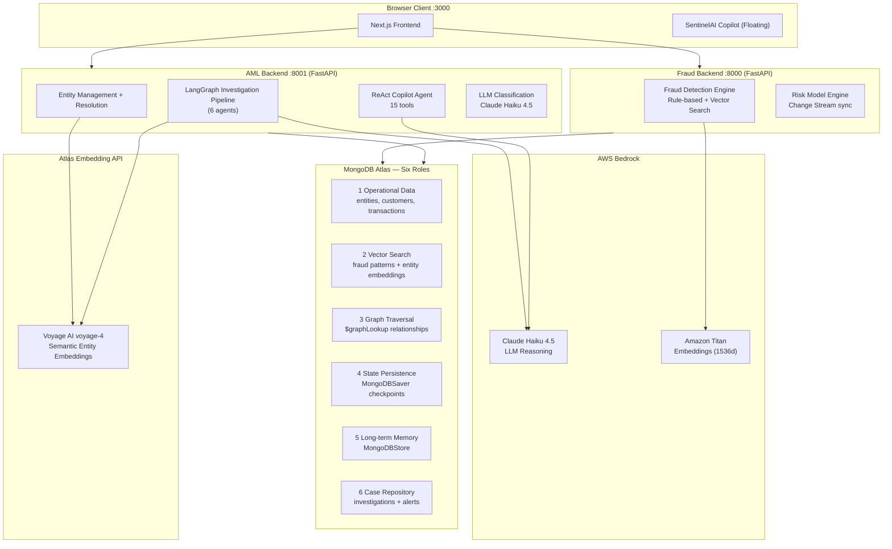
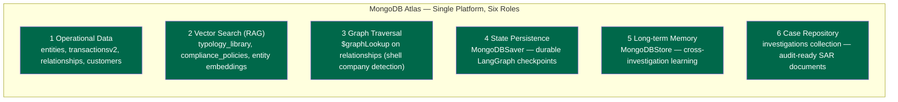
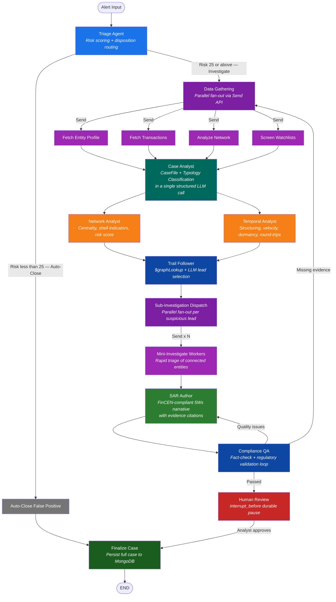

# SentinelAI — Judges' Technical Overview

> **Autonomous Financial Crime Investigation Platform powered by MongoDB Atlas + AWS Bedrock**

---

## Table of Contents

1. [The Problem We Solve](#1-the-problem-we-solve)
2. [What SentinelAI Is](#2-what-sentinelai-is)
3. [Architecture at a Glance](#3-architecture-at-a-glance)
4. [MongoDB Atlas — The Unified Data Platform](#4-mongodb-atlas--the-unified-data-platform)
5. [Agentic Investigation Pipeline (LangGraph)](#5-agentic-investigation-pipeline-langgraph)
6. [SentinelAI Copilot (ReAct Chat Agent)](#6-sentinelai-copilot-react-chat-agent)
7. [AI & Embedding Strategy](#7-ai--embedding-strategy)
8. [Entity Management & Resolution](#8-entity-management--resolution)
9. [Fraud Detection Engine](#9-fraud-detection-engine)
10. [Frontend & UX Highlights](#10-frontend--ux-highlights)
11. [End-to-End Example Investigation](#11-end-to-end-example-investigation)
12. [Why SentinelAI Wins](#12-why-sentinelai-wins)
13. [Technology Stack Summary](#13-technology-stack-summary)

---

## 1. The Problem We Solve

> *Financial institutions detect millions of fraud signals and AML alerts daily, but investigation workflows remain **manual, slow, and expensive**. Compliance teams must analyze contextual data, justify decisions to regulators, and manage overwhelming backlogs — often spending hours on each case.*

**The real-world impact of the status quo:**
- ⏱️ Investigators spend 4–8 hours per SAR (Suspicious Activity Report)
- 🗂️ Alert backlogs grow faster than teams can clear them
- ❌ High false-positive rates waste analyst time on benign transactions
- ⚠️ Regulatory penalties for late or inaccurate SAR filings cost millions
- 🕸️ Shell company networks and layering schemes are nearly impossible to trace manually

**SentinelAI turns hours of manual investigation into seconds of autonomous, AI-driven analysis** — while keeping a human analyst in the loop for final approval.

---

## 2. What SentinelAI Is

SentinelAI is a **full-stack, multi-agent financial crime investigation platform** that covers the complete compliance lifecycle:

| Module | What It Does |
|--------|-------------|
| 🔍 **Fraud Detection Engine** | Real-time transaction risk scoring with rules + vector similarity |
| 🏢 **Entity Management** | Customer 360° profiles, risk scoring, watchlist screening |
| 🔗 **Entity Resolution** | AI-powered duplicate detection and identity matching at onboarding |
| 🤖 **Agentic SAR Pipeline** | 6-agent LangGraph pipeline: autonomous end-to-end AML investigation |
| 💬 **SentinelAI Copilot** | Global conversational assistant with 15 MongoDB-backed tools |
| 📊 **Risk Model Management** | Dynamic, real-time configurable fraud risk weights via Change Streams |
| 📁 **Network / Graph Analysis** | Shell company and money-layering detection via `$graphLookup` |

---

## 3. Architecture at a Glance



**Three services, one data platform:**
- **Fraud Backend** (:8000) — Transaction screening + risk model management
- **AML Backend** (:8001) — Entity management, agentic investigations, Copilot
- **Frontend** (:3000) — Next.js 15 App Router with MongoDB LeafyGreen UI

---

## 4. MongoDB Atlas — The Unified Data Platform

> MongoDB Atlas is not just the database. It is the **entire intelligence substrate** of SentinelAI, used in **6 distinct roles** — eliminating the need for separate vector databases, graph engines, state stores, and case management systems.



### MongoDB Features Used

| Feature | Where Used | Why It Matters |
|---------|-----------|----------------|
| **Atlas Vector Search** | Fraud pattern matching, entity similarity, RAG typology retrieval | Finds semantically similar entities/transactions without exact text match |
| **Atlas Search (`$search`)** | Entity lookup, autocomplete, faceted filtering | Fuzzy matching across names, addresses, identifiers |
| **`$rankFusion` (Hybrid Search)** | Entity resolution onboarding | Combines text + vector scores for maximum recall |
| **`$graphLookup`** | Network analysis, trail following, relationship traversal | Multi-hop ownership chain tracing — no separate graph DB needed |
| **Change Streams** | Real-time risk model sync, WebSocket monitoring | Frontend receives live model updates without polling |
| **MongoDBSaver** | LangGraph checkpoint persistence | Investigations survive backend restarts; analysts can resume days later |
| **MongoDBStore** | Cross-investigation memory | Long-term agent learning across cases |
| **Document Model** | Entity 360° profile, nested risk factors | No joins needed — entire customer context in a single document |

---

## 5. Agentic Investigation Pipeline (LangGraph)

> The crown jewel of SentinelAI. A **LangGraph StateGraph** with specialized agent nodes that autonomously transforms a raw AML alert into a FinCEN-compliant SAR narrative — with durable human-in-the-loop review.

### Pipeline Flow



### Agent Node Details

| Agent | Role | LangGraph Primitive |
|-------|------|---------------------|
| **Triage** | Scores risk 0–100, auto-closes FPs (<25), routes high-risk cases | `Command(goto=...)` |
| **Data Gathering Dispatch** | Fires 4 parallel data-fetch workers simultaneously | `Send` fan-out |
| **Case Analyst** | Builds 360° CaseFile + classifies AML crime typology in one LLM call | `with_structured_output` |
| **Network Analyst** | `$graphLookup` centrality, shell company indicators, network risk score | MongoDB aggregation |
| **Temporal Analyst** | Structuring detection, velocity z-score, dormancy bursts, round-trips | MongoDB aggregation |
| **Trail Follower** | Traces ownership chains, LLM selects top 3 suspicious leads | `$graphLookup` + LLM |
| **Mini-Investigate (×N)** | Rapid triage of each connected entity in parallel | `Send` per lead |
| **SAR Author** | Writes FinCEN-compliant who/what/when/where/why/how narrative | `with_structured_output` |
| **Compliance QA** | Fact-checks citations, validates regulatory format — loops up to 2× | Evaluator-optimizer loop |
| **Human Review** | Durable analyst pause — approve / reject / request changes | `interrupt_before` |
| **Finalize** | Writes complete case + audit trail to MongoDB | MongoDB insert |

### Key LangGraph Patterns

```
Command(goto=...)       → Dynamic routing at Triage and Compliance QA
Send(node, state)       → Parallel fan-out for data gathering + sub-investigations
interrupt_before        → Durable human review gate (survives restarts via MongoDBSaver)
with_structured_output  → Pydantic-typed LLM responses for type-safe agent decisions
MongoDBSaver            → Full checkpoint persistence — analysts can resume days later
MongoDBStore            → Cross-investigation long-term memory
```

### Temporal Analysis — What It Detects

| Pattern | Detection Method | Fraud Signal |
|---------|-----------------|--------------|
| **Structuring** | Transactions $8k–$10k grouped by day | Splitting payments to evade reporting threshold |
| **Velocity anomaly** | Z-score > 2.0 vs. 90-day baseline | Sudden spike indicating account compromise or fraud |
| **Dormancy burst** | >30-day gap then sudden high activity | Dormant/sleeper account suddenly activated |
| **Off-hours activity** | % volume during 10pm–6am / weekends | Unusual timing for the entity's account type |
| **Round-trip patterns** | Money sent to A, returned from A within 7 days | Layering / circular transaction detection |

---

## 6. SentinelAI Copilot (ReAct Chat Agent)

> A **globally available conversational AI assistant** — floating on every page — powered by a LangGraph `create_react_agent` with **15 MongoDB-backed tools** and rich artifact rendering.

### 15 Tools Across 5 Categories

| Category | Tools |
|----------|-------|
| **Entity Tools (6)** | `get_entity_profile`, `screen_watchlists`, `search_entities`, `find_similar_entities` (Vector Search), `compare_entities`, `assess_entity_risk` |
| **Transaction Tools (3)** | `query_entity_transactions`, `trace_fund_flow`, `analyze_temporal_patterns` |
| **Network Tools (1)** | `analyze_entity_network` (`$graphLookup`) |
| **Policy Tools (3)** | `lookup_typology`, `search_typologies`, `search_compliance_policies` |
| **Investigation Tools (2)** | `search_investigations`, `get_investigation_detail` |

### Artifact Rendering

The Copilot produces **rich artifacts** in a dedicated side panel beyond plain text:

| Artifact Type | Rendering | Example Use Case |
|---------------|-----------|-----------------|
| **Markdown** | `react-markdown` + GFM | Entity risk report, investigation summary |
| **Mermaid Diagram** | Dynamic SVG render | Fund flow graph, entity network diagram |
| **Interactive HTML** | Sandboxed `<iframe>` with Tailwind | Custom dashboards, comparative tables |

> Thread persistence via `MongoDBSaver` — conversations survive page refreshes and backend restarts. Analysts can pick up where they left off at any time.

---

## 7. AI & Embedding Strategy

SentinelAI uses a **two-model embedding strategy** optimized for each domain:

| Domain | Model | Provider | Dimensions | Purpose |
|--------|-------|----------|-----------|---------|
| Transaction fraud patterns | **Amazon Titan Embeddings** | AWS Bedrock | 1536d | Semantic fraud pattern matching |
| Entity profiles & identity | **Voyage AI `voyage-4`** | Atlas Embedding API | — | Semantic entity similarity, RAG retrieval |
| Typologies & policies | **Voyage AI `voyage-4`** | Atlas Embedding API | — | RAG-powered typology classification |

**LLM: Claude Haiku 4.5 on AWS Bedrock** for all agent reasoning.

All LLM calls use **`with_structured_output()`** with Pydantic models for type-safe, schema-validated agent decisions — no unstructured text parsing, no hallucinated fields.

---

## 8. Entity Management & Resolution

### Entity Management — Customer 360° in One Document

```
Entity Document:
  ├── entityId, entityType (individual / corporation / PEP / shell_company)
  ├── name.full, name.aliases
  ├── addresses (multiple, with GeoJSON)
  ├── identifiers (passport, TIN, LEI, etc.)
  ├── riskAssessment.overall.score (0–100) + level (low/medium/high/critical)
  ├── riskAssessment.factors (PEP, sanctions, transaction_patterns, ...)
  ├── watchlistStatus (OFAC, EU, UN sanctions + PEP lists)
  ├── transactionSummary (volume, count, high_risk_count)
  ├── profileEmbedding (Voyage AI semantic vector)
  └── relationships → links to other entities
```

No joins required. The entire compliance context lives in a **single MongoDB document**.

### Entity Resolution — 5-Step AI Onboarding

| Step | Action | MongoDB Feature |
|------|--------|----------------|
| **0 — Input** | Analyst enters name, address, entity type | — |
| **1 — Parallel Search** | Atlas Search + Vector Search + Hybrid Search run simultaneously | Atlas Search, `$vectorSearch`, `$rankFusion` |
| **2 — Network Analysis** | Graph analysis of top 3 candidate matches (depth-2 traversal) | `$graphLookup` |
| **3 — AI Classification** | Claude Haiku assesses risk, flags AML/KYC concerns | AWS Bedrock |
| **4 — Case Generation** | Automated case document creation + PDF export | MongoDB insert, ReportLab |

**`$rankFusion` Hybrid Search** catches variations like "John Smith" vs "J. Smith" vs "John A. Smith" with maximum recall.

---

## 9. Fraud Detection Engine

### Multi-Factor Risk Scoring

| Factor | Weight | Detection Method |
|--------|--------|-----------------|
| **Transaction Amount** | 25% | Deviation from customer's 90-day average |
| **Location** | 25% | Distance from usual GeoJSON locations |
| **Device** | 20% | New/unrecognized device fingerprint |
| **Velocity** | 15% | Multiple transactions within time window |
| **Vector Pattern** | 15% | Similarity to known fraud patterns via Atlas Vector Search |

### Dynamic Risk Models via Change Streams

Risk weights are fully configurable via the Admin Panel. When a model is updated, MongoDB **Change Streams** push the new weights to the backend instantly — **zero restarts required**.

---

## 10. Frontend & UX Highlights

Built with **Next.js 15 App Router** + **MongoDB LeafyGreen UI**:

| Route | Feature |
|-------|---------|
| `/investigations` | Agentic investigation control room — launch, monitor, review |
| `/entities` | Entity search with Atlas Search autocomplete + faceted filtering |
| `/entities/[id]` | Entity 360° — profile, Cytoscape.js network graph, transactions |
| `/entity-resolution/enhanced` | 5-step AI onboarding workflow |
| `/transaction-simulator` | Interactive fraud scenario testing |
| `/risk-models` | Dynamic risk model CRUD with live Change Stream updates |

**Live Pipeline Visualization**: A React Flow graph that animates in real-time via SSE — agent nodes glow as they activate, `Send` fan-out is animated, and the Human Review panel slides in when the pipeline pauses.

---

## 11. End-to-End Example Investigation

> SentinelAI completes in **~47 seconds** what takes a human analyst **4–8 hours**:

```
ALERT RECEIVED
  entity_id = ENT-001, alert_type = HIGH_VOLUME_TRANSACTIONS

TRIAGE AGENT (2 sec)
  risk_score = 72 → disposition: INVESTIGATE
  typology_hint = "possible structuring"

DATA GATHERING — PARALLEL (3 sec)
  Entity Profile: Corporation, risk=72, medium-high
  Transactions:   28 total, 5 flagged, $2.3M volume
  Network:        14 connected entities, 3 shell indicators
  Watchlist:      1 PEP hit (score=0.87)

CASE ANALYST + TYPOLOGY (4 sec)
  primary_typology = STRUCTURING (confidence=0.82)
  secondary = [SANCTIONS_EVASION]
  key_findings = ["Multiple sub-threshold transactions", "PEP connection"]

PARALLEL ANALYSIS (5 sec)
  Network: centrality=0.71 (hub entity), risk_score=81.3
  Temporal: structuring on 4 days, dormancy burst ($890k in 3 days), z_score=3.2

TRAIL FOLLOWER (5 sec)
  ENT-001 → owns → SHL-7568 → controls → SHL-9923
  Leads: [SHL-7568 (high), PEP2-1EE3 (critical), CORP-4421 (medium)]

SUB-INVESTIGATIONS — PARALLEL (8 sec)
  SHL-7568: risk=HIGH → escalate
  PEP2-1EE3: risk=CRITICAL → escalate
  CORP-4421: risk=MEDIUM → monitor

SAR NARRATIVE (10 sec)
  3,200-char FinCEN-compliant narrative
  14 evidence citations across all 9 mandatory SAR sections

COMPLIANCE QA (5 sec)
  score=0.94, is_valid=TRUE → routes to Human Review

HUMAN REVIEW → Analyst approves

FINALIZED
  CASE-A7F2C1D3 persisted to MongoDB
  8 LLM calls | 12 tool calls | 47 seconds total
```

---

## 12. Why SentinelAI Wins

### Innovation

| What We Built | Why It's Novel |
|---------------|---------------|
| **Durable HITL Pipeline** | `interrupt_before` + `MongoDBSaver` = investigations survive restarts; analysts resume days later |
| **Parallel Sub-Investigations** | `Send` fan-out spawns N mini-investigate workers simultaneously — not sequential |
| **Evaluator-Optimizer Loop** | Compliance QA loops back to data gathering or narrative if quality thresholds fail |
| **MongoDB as 6-Role Platform** | Vector DB + Graph DB + State Store + Case Repo + Operational DB + Memory = all in one |
| **Live Pipeline Visualization** | ReactFlow graph that animates with SSE-streamed node activations in real-time |
| **Hybrid Search at Onboarding** | `$rankFusion` combining Atlas Search + Voyage AI vectors for maximum identity match recall |

### Business Impact

| Metric | Status Quo | SentinelAI |
|--------|-----------|------------|
| Investigation time | 4–8 hours | ~47 seconds |
| False positive handling | Manual review every alert | Auto-closed if risk < 25 |
| SAR narrative | Written by hand | Auto-generated, evidence-cited |
| Analyst role | Full investigation | Final review + approval only |
| Audit trail | Manual notes | Immutable, machine-generated |
| Regulatory grounding | Analyst knowledge | RAG over FinCEN corpus |

---

## 13. Technology Stack Summary

| Layer | Technology |
|-------|-----------|
| **Orchestration** | LangGraph 1.0.7 — StateGraph, Command, Send, interrupt_before |
| **LLM** | Claude Haiku 4.5 via AWS Bedrock (`ChatBedrockConverse`) |
| **Embeddings (Transactions)** | Amazon Titan (1536d) via AWS Bedrock |
| **Embeddings (Entities/RAG)** | Voyage AI `voyage-4` via MongoDB Atlas Embedding API |
| **Database** | MongoDB Atlas (M10+) — operational + vector + graph + state |
| **Backend** | FastAPI (Python 3.10–3.12) × 2 microservices |
| **Frontend** | Next.js 15 (App Router) + MongoDB LeafyGreen UI |
| **Graph Visualization** | React Flow (`@xyflow/react`) + Cytoscape.js |
| **Real-time** | SSE (agent streaming) + WebSocket (Change Streams) |
| **State Persistence** | `MongoDBSaver` (checkpoints) + `MongoDBStore` (long-term memory) |
| **Deployment** | Docker Compose / Kubernetes / Local dev |

---

> *SentinelAI — Autonomous Financial Crime Investigation Platform*
> *Built on MongoDB Atlas · Powered by AWS Bedrock Claude Haiku 4.5 · Orchestrated by LangGraph*
